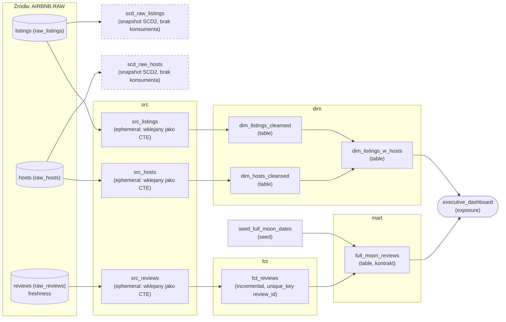

# dbt na Snowflake — Airbnb pipeline

Projekt dbt Core zbudowany na bazie projektu szkoleniowego i rozszerzony o własne dodatki.
Dane: listings/hosts/reviews Airbnb, ładowane z S3 do Snowflake (`AIRBNB.RAW`).

## Struktura

```
models/src/        # src_* — ephemeral, jeden model na tabelę źródłową
models/dim/         # dim_* — wymiary (table)
models/fct/         # fct_reviews — fakt, incremental
models/mart/         # full_moon_reviews — finalna tabela biznesowa
models/documents/   # custom overview + doc() bloki dla dbt docs
seeds/               # seed_full_moon_dates.csv
snapshots/           # SCD2 dla listings i hosts (hard_deletes: invalidate, tabele permanentne)
tests/                # singular testy + wywołania generic testów
macros/               # positive_value, no_nulls_in_columns, logowanie/zmienne (operacje)
analyses/             # zapytania eksploracyjne (dbt compile, bez materializacji)
assets/               # obrazy osadzane w dbt docs (asset-paths)
```

## Lineage (DAG)

Co z czym łączy się przez `source()` i `ref()`. Krawędzie wygenerowane z `target/manifest.json`. W nawiasie materializacja.



Linia przerywana w ramce oznacza ślepą uliczkę: obiekt się buduje, ale nic go nie czyta. Oba snapshoty SCD2 zbierają historię obok obu gałęzi dashboardu — żaden model ich nie `ref()`-uje. `executive_dashboard` to exposure: czyta dwie niezależne gałęzie, wymiary ofert i mart z recenzjami.

Podgląd gałęzi z terminala: `uv run dbt ls -s +exposure:executive_dashboard --profiles-dir .` (wszystko pod dashboardem) albo `-s +full_moon_reviews` (przodkowie martu).

## Setup

Autoryzacja: **para kluczy RSA (key-pair)**, nie hasło — standardowa metoda Snowflake dla użytkownika serwisowego (`TYPE=SERVICE`, `RSA_PUBLIC_KEY`). Klucz prywatny nie wygasa jak sesja logowania i działa wszędzie bez ponownego uwierzytelniania.

### 1. Snowflake — role, warehouse, użytkownik, import danych

**Wygeneruj parę kluczy RSA lokalnie** (klucz prywatny zostaje POZA folderem repo):

```bash
mkdir -p ~/.snowflake
openssl genrsa 2048 | openssl pkcs8 -topk8 -inform PEM -out ~/.snowflake/rsa_key.p8 -nocrypt
openssl rsa -in ~/.snowflake/rsa_key.p8 -pubout -out ~/.snowflake/rsa_key.pub

# Klucz publiczny do wklejenia w SQL niżej - bez linii BEGIN/END i bez łamań linii
grep -v -- '-----' ~/.snowflake/rsa_key.pub | tr -d '\n'
```

**W konsoli Snowflake (Worksheet), jako `ACCOUNTADMIN`** — provisioning roli, warehouse'u i użytkownika serwisowego:

```sql
USE ROLE ACCOUNTADMIN;

-- Snowflake liczy koszt za CZAS działania warehouse'u, nie za dane. ALTER, a nie tylko
-- CREATE ... IF NOT EXISTS: konto trial ma COMPUTE_WH z góry, więc parametry z CREATE by nie weszły.
CREATE WAREHOUSE IF NOT EXISTS COMPUTE_WH;
ALTER WAREHOUSE COMPUTE_WH SET
  WAREHOUSE_SIZE = XSMALL
  AUTO_SUSPEND = 60                     -- sekundy bezczynności do wyłączenia (default 600)
  AUTO_RESUME = TRUE
  STATEMENT_TIMEOUT_IN_SECONDS = 600;   -- zapętlone zapytanie nie pali kredytów przez 2 dni (default 172800)

-- Twardy limit kredytów: 100% zawiesza warehouse. Profil dbt tego nie załatwi - to obiekt konta.
CREATE RESOURCE MONITOR IF NOT EXISTS DBT_MONITOR
  WITH CREDIT_QUOTA = 10 FREQUENCY = MONTHLY START_TIMESTAMP = IMMEDIATELY
  TRIGGERS ON 80 PERCENT DO NOTIFY ON 100 PERCENT DO SUSPEND;
ALTER WAREHOUSE COMPUTE_WH SET RESOURCE_MONITOR = DBT_MONITOR;

CREATE ROLE IF NOT EXISTS TRANSFORM;
GRANT ROLE TRANSFORM TO ROLE ACCOUNTADMIN;
-- USAGE + OPERATE, nie ALL: ALL zawiera MODIFY, czyli rola dbt mogłaby powiększyć warehouse.
GRANT USAGE, OPERATE ON WAREHOUSE COMPUTE_WH TO ROLE TRANSFORM;

CREATE USER IF NOT EXISTS dbt
  LOGIN_NAME = 'dbt'
  TYPE = SERVICE
  RSA_PUBLIC_KEY = '<<wklej tu output z grep -v powyżej>>'
  DEFAULT_ROLE = TRANSFORM
  DEFAULT_WAREHOUSE = 'COMPUTE_WH'
  DEFAULT_NAMESPACE = 'AIRBNB.RAW'
  COMMENT = 'dbt user do transformacji danych';

GRANT ROLE TRANSFORM TO USER dbt;

CREATE DATABASE IF NOT EXISTS AIRBNB;
CREATE SCHEMA IF NOT EXISTS AIRBNB.RAW;
CREATE SCHEMA IF NOT EXISTS AIRBNB.DEV;

-- ALL na bazie zawiera CREATE SCHEMA: dbt sam tworzy DEV_SNAPSHOTS i zostaje jego właścicielem.
-- Schematy wprost, nie ALL/FUTURE SCHEMAS - inaczej rola dev dostałaby też PROD i PROD_SNAPSHOTS.
GRANT ALL ON DATABASE AIRBNB TO ROLE TRANSFORM;
GRANT ALL ON SCHEMA AIRBNB.RAW TO ROLE TRANSFORM;
GRANT ALL ON SCHEMA AIRBNB.DEV TO ROLE TRANSFORM;
GRANT ALL ON ALL TABLES IN SCHEMA AIRBNB.RAW TO ROLE TRANSFORM;
GRANT ALL ON FUTURE TABLES IN SCHEMA AIRBNB.RAW TO ROLE TRANSFORM;
```

**Import surowych danych z S3** (publiczny bucket `s3://dbt-datasets`, `USE ROLE TRANSFORM; USE DATABASE AIRBNB; USE SCHEMA RAW;` najpierw):

```sql
CREATE OR REPLACE TABLE raw_listings (
    id INTEGER, listing_url STRING, name STRING, room_type STRING,
    minimum_nights INTEGER, host_id INTEGER, price STRING,
    created_at DATETIME, updated_at DATETIME
);
COPY INTO raw_listings
  FROM 's3://dbt-datasets/listings.csv'
  FILE_FORMAT = (type = 'CSV' skip_header = 1 FIELD_OPTIONALLY_ENCLOSED_BY = '"');

CREATE OR REPLACE TABLE raw_hosts (
    id INTEGER, name STRING, is_superhost STRING,
    created_at DATETIME, updated_at DATETIME
);
COPY INTO raw_hosts
  FROM 's3://dbt-datasets/hosts.csv'
  FILE_FORMAT = (type = 'CSV' skip_header = 1 FIELD_OPTIONALLY_ENCLOSED_BY = '"');

CREATE OR REPLACE TABLE raw_reviews (
    listing_id INTEGER, date DATETIME, reviewer_name STRING,
    comments STRING, sentiment STRING
);
COPY INTO raw_reviews
  FROM 's3://dbt-datasets/reviews.csv'
  FILE_FORMAT = (type = 'CSV' skip_header = 1 FIELD_OPTIONALLY_ENCLOSED_BY = '"');
```

**Prod (opcjonalnie, tylko pod `--target prod`)** — osobny user i rola, żeby klucz dev nie mógł pisać do prod. `REPORTER` to odbiorca `+grants` z `dbt_project.yml` (BI, patrz `models/dashboards.yml`): grants działa tylko w prod, bo GRANT do nieistniejącej roli wywraca build. Klucz prod generujesz jak wyżej, pod inną nazwą pliku.

```sql
USE ROLE ACCOUNTADMIN;
CREATE SCHEMA IF NOT EXISTS AIRBNB.PROD;

CREATE ROLE IF NOT EXISTS TRANSFORM_PROD;
GRANT USAGE, OPERATE ON WAREHOUSE COMPUTE_WH TO ROLE TRANSFORM_PROD;
GRANT USAGE, CREATE SCHEMA ON DATABASE AIRBNB TO ROLE TRANSFORM_PROD;   -- dbt tworzy PROD_SNAPSHOTS
GRANT USAGE ON SCHEMA AIRBNB.RAW TO ROLE TRANSFORM_PROD;
GRANT SELECT ON ALL TABLES IN SCHEMA AIRBNB.RAW TO ROLE TRANSFORM_PROD;     -- RAW tylko do odczytu
GRANT SELECT ON FUTURE TABLES IN SCHEMA AIRBNB.RAW TO ROLE TRANSFORM_PROD;
GRANT ALL ON SCHEMA AIRBNB.PROD TO ROLE TRANSFORM_PROD;

CREATE USER IF NOT EXISTS dbt_prod
  TYPE = SERVICE
  RSA_PUBLIC_KEY = '<<klucz publiczny prod>>'
  DEFAULT_ROLE = TRANSFORM_PROD
  DEFAULT_WAREHOUSE = 'COMPUTE_WH';
GRANT ROLE TRANSFORM_PROD TO USER dbt_prod;

CREATE ROLE IF NOT EXISTS REPORTER;
GRANT USAGE ON WAREHOUSE COMPUTE_WH TO ROLE REPORTER;
GRANT USAGE ON DATABASE AIRBNB TO ROLE REPORTER;
GRANT USAGE ON SCHEMA AIRBNB.PROD TO ROLE REPORTER;   -- SELECT na tabelach nadaje dbt (+grants)
```

Snapshoty trafiają do `<schemat targetu>_SNAPSHOTS` (`DEV_SNAPSHOTS` / `PROD_SNAPSHOTS`) — dbt tworzy te schematy sam, a rola, która je utworzy, zostaje ich właścicielem. `REPORTER` nie dostaje do nich dostępu: BI czyta marty.

### 2. Repo i środowisko Python

Wymagane: [uv](https://docs.astral.sh/uv/) (`brew install uv`). Pythona 3.11 uv pobierze sam, jeśli go brakuje.

```bash
git clone https://github.com/pmackowka/dbt-snowflake.git
cd dbt-snowflake
uv sync   # .venv dokładnie według uv.lock (dbt-snowflake==1.12.0 + przypięte dbt-core i reszta drzewa)
```

`pyproject.toml` to zależności bezpośrednie (pisane ręcznie), `uv.lock` całe drzewo z hashami (generowany), `.python-version` wersja interpretera. Nowa zależność: `uv add <pakiet>`, podbicie adaptera: `uv lock --upgrade-package dbt-snowflake`.

### 3. Konfiguracja połączenia

```bash
cp profiles.yml.example profiles.yml   # profiles.yml jest w .gitignore - nigdy go nie commituj
export SNOWFLAKE_ACCOUNT="xy12345.us-east-2.aws"   # z URL-a konsoli, przed .snowflakecomputing.com (albo orgname-accountname)
export SNOWFLAKE_USER="dbt"
export SNOWFLAKE_PRIVATE_KEY_PATH="$HOME/.snowflake/rsa_key.p8"
export SNOWFLAKE_PRIVATE_KEY_PASSPHRASE=""   # puste, bo klucz wygenerowany z -nocrypt

uv run dbt deps --profiles-dir .    # instaluje pakiety z packages.yml do dbt_packages/
uv run dbt debug --profiles-dir .   # weryfikuje połączenie PRZED pierwszym run
```

Pod `--target prod` dodatkowo `SNOWFLAKE_PROD_ACCOUNT`, `SNOWFLAKE_PROD_USER`, `SNOWFLAKE_PROD_PRIVATE_KEY_PATH` — bez fallbacku na zmienne dev, więc bez nich prod się nie połączy.

### 4. Build

```bash
uv run dbt source freshness --profiles-dir .   # osobna komenda - dbt build freshness NIE sprawdza
uv run dbt build --profiles-dir .              # seed + snapshot + run + test, kolejność wg DAG-a
```

Freshness na jednorazowo zaimportowanych danych po dobie zawsze zwróci `error` — to oczekiwane (komentarz w `models/sources.yml`). W orkiestracji to ona byłaby bramką przed buildem.

Backfill zakresu dat w `fct_reviews` (MERGE po `review_id`, więc ponowne wczytanie zakresu nie dubluje wierszy). `end_date` jest wyłączny (`<`), więc podaj początek następnego dnia:

```bash
uv run dbt run --select fct_reviews --vars '{start_date: "2024-02-15 00:00:00", end_date: "2024-03-16 00:00:00"}' --profiles-dir .
```

## Notatki (prywatne, tylko dla mnie)

Pełne notatki merytoryczne z pracy nad tym projektem (Analyses/Hooks/Exposures, debugging przez `dbt-expectations`, logowanie, zmienne, orkiestracja Dagster) są w moim prywatnym repo wiedzy: [dbt-Snowflake-i-Orkiestracja-Dagster.md](https://github.com/pmackowka/knowledge-base/blob/main/wiki/Software/dbt/dbt-Snowflake-i-Orkiestracja-Dagster.md).

Ten link **działa tylko na moim koncie GitHub** — repo jest prywatne i takie zostanie. Dla każdego innego zwraca 404, to celowe, nie błąd.
